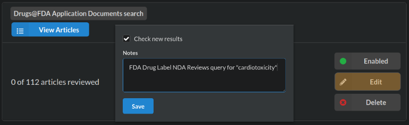

```{r setup, include=F}
library(glue)
library(rsr)
knitr::opts_chunk$set(fig.path = "man/figures/")
```

Sysrev provides a Drugs\@FDA searchable stream for document reviews which politely ingests PDFs and metadata from [labels.fda.gov](https://labels.fda.gov/). 

The docs/metadata are indexed with a PDF parsing / OCR function to enable full text search and categorization. Sysrev also creates a versioning system for FDA documents by evaluating FDA application numbers and types. 

In this vignette, you will learn to:  
**Search** Drugs\@FDA --> **Review** drug labels --> **Analyze** the results.


```{r echo=F}
# graph    = function(var,style,fillcolor,label,shape){}
# node     = function(var,style,fillcolor,label,shape){}
# subgraph = function(name){glue("subgraph cluster_{name} {{")}
fdanode = glue('subgraph cluster_0 {{
  graph         [style=filled fillcolor=HoneyDew label=<<B>External Source</B>>]
  node          [style=filled fillcolor=white width=1.5 shape=rectangle];
  FDA           [label = <<B>Drugs@FDA</B>> fillcolor="#ff6600ff"]
  CT            [label = "ClinicalTrials" ]
  PubMed        [label = "PubMed" ]
  FDA -> CT     [style=invis]
  CT  -> PubMed [style=invis]
}}')

sysrev  = glue('subgraph cluster_1 {{
  graph   [style=filled fillcolor="#a9bde6ff" label=<<B>Review Entities</B>>]
  node    [style=filled fillcolor=white width=1.5 shape="rectangle"];
  {{
    rank=same;
    source1 [label="source" width=0.4]
    labels1 [label="labels" width=0.4]
  }}
  revs    [label="reviewers"]
  sysrev1 [label="sysrev.com/p/..." shape="rectangle"]
  labels1 -> revs
  source1 -> revs
  revs -> sysrev1
}}')

datapub = function(){glue('subgraph cluster_b {{
      graph [style="filled" fillcolor=brown2 label = <<B> Build Stream </B>> ]
      node  [style="filled" fillcolor="white" width=1.5]
      {{
        Index    [label = "Indexing", shape="rectangle" ]
        Version  [label = "Versioning", shape="rectangle" ]
        Datapub  [label = "Stream API", shape="rectange"]
      }}
    }}'
)}

analysis = function(){glue('subgraph cluster_analysis {{
      graph [style="filled" fillcolor=darkorchid1 label =<<B>Analyze</B>> ]
      node  [style="filled" fillcolor="white" width=1.5 shape=rectangle]
      {{
        rsr [label="r.sysrev"]
        a   [label="Applications"]
        b   [style=invis]
      }}
      rsr -> a
      a   -> b [style=invis]
}}'
)}
    

DiagrammeR::grViz(glue('digraph G {{
    newrank=true;

    graph [splines=ortho nodesep="0.15" ranksep="0.2"]
    {fdanode}
    {datapub()}
    {sysrev}
    {analysis()}
    
    FDA     -> Index
    CT      -> Index
    PubMed  -> Index
    Index   -> Version
    Version -> Datapub
    Datapub -> source1
    sysrev1 -> rsr;
    
    {{ rank=same; FDA; Index; source1; rsr}}
    
  }}'),height=250)
```

## Cardiotox\@FDA sysrev
Let's create a cardiotoxicity and browse to sysrev.com/p/111474.
```{r results=F}
create_sysrev("Cardiotox@FDA",get_if_exists=T) 
browse_sysrev(pid=111474)
```

We are working on automation, but for now we need to click things to get our FDA docs. We'll select new drug application **`NDA`** documents of document type **`label`** that match **"cardiotoxicity"**. Learn more about FDA applications types at [FDA How Drugs Are Developed.](https://www.fda.gov/drugs/how-drugs-are-developed-and-approved/types-applications)

```{r fda_docs, fig.cap="Creating a Drugs\\@FDA source for [Cardiotox@FDA](https://sysrev.com/p/111474)", out.width = '100%', echo=F}
knitr::include_graphics("./figures/cardiotox-source.png")
```

The search results in 40 articles, a manageable size for a short vignette. 'Import' pushes the labels into Cardiotox\@FDA. We can inspect the data source, add notes, and set it to automatically add new articles that match our query by clicking "check new results".

```{r fda_living_docs, fig.cap="Clicking **check for new results** makes a living review", out.width = '100%', echo=F}

```


## Annotate hazards
## Automate annotation
## Counting things
